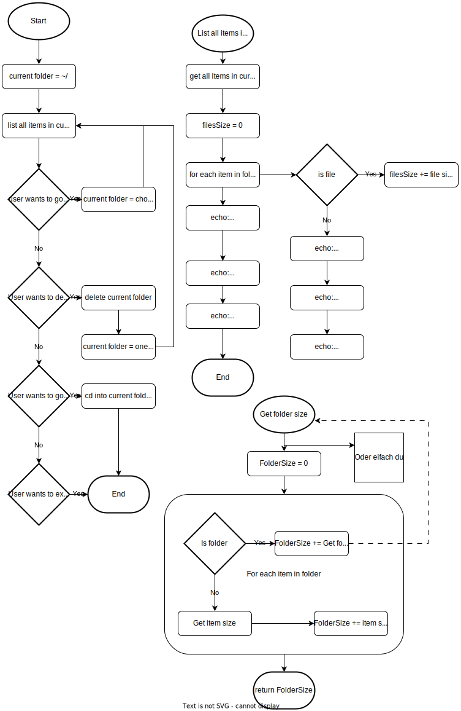

# Modul 122

| Leistungsbeurteilung LB1 | |
| --- | ---|
| Modul | IET-122 Praxisarbeit |
| Eingereicht von | Iwen Aeschlimann & Niklas Bereitenstein|
| Eingereicht bei | Alexis Winiger |
| Datum | 15. Mai 2023 |

# 1 Ziele und Anforderungen

## 1.1 Einleitung

Iwen und ich haben beide nicht so viel Erfahrung mit bash. Wobei ich , Niklas, vielleicht ein wenig mehr habe, da ich ein vollzeit Linux User bin.

Dementsprechend war das Projekt eher schwierig und wir haben uns des öfteren an hilfsmittel wie _StackOverflow_ oder _ChatGPT_ bedient.

## 1.2 Zweck des Skriptes

JFK ist ein Bash-Verzeichnisnavigator, mit dem Benutzer durch Verzeichnisse navigieren, Dateigrößen anzeigen und
grundlegende Dateioperationen durchführen können. Das Skript bietet eine Befehlszeilenschnittstelle, über die
der Benutzer Befehle zum Navigieren in Verzeichnissen eingeben kann. Es zeigt den Inhalt des aktuellen Verzeichnisses, einschließlich der Unterverzeichnisse und
Dateien, zusammen mit ihrer jeweiligen Größe an. Der Benutzer kann ein Verzeichnis durch Eingabe der
entsprechenden Nummer auswählen oder mit ".." zum übergeordneten Verzeichnis navigieren. Zusätzlich bietet das Skript die Möglichkeit, das aktuelle
Verzeichnis und dessen Inhalt mit dem Befehl "dd" zu löschen. Das Skript läuft in einer Schleife, bis der Benutzer den Vorgang mit "q abbricht.
JFK vereinfacht die Identifizierung von grossen Verzeichnissen und bietet eine benutzerfreundliche
Schnittstelle für Dateioperationen in einer Befehlszeilenumgebung.

## 1.3 Ziele

Unser Hauptziel ist sicherlich es einfacher zu machen grosse Verzeichnisse zu finden un zu löschen.  
Um dies zu realisieren, sollen alle aktuellen Verzeichnisse im aktuellen Verzeichnis mit ihrem Gewicht nach der Grösse geordnet angezeigt werden.     

## 1.4Anforderungen

### 1.4.1 Allgemeine Anforderungen

Die Bash-Verzeichnisnavigation soll folgende allgemeine Anforderungen erfüllen:

 - Benutzerfreundliche Benutzeroberfläche: Das Skript soll eine intuitive und leicht verständliche Benutzeroberfläche bieten, um die Navigation durch Verzeichnisse zu erleichtern.
- Verzeichnisübersicht: Das Skript soll dem Benutzer eine übersichtliche Darstellung der Inhalte des aktuellen Verzeichnisses bieten.
 - Navigation: Der Benutzer sollte in der Lage sein, durch Eingabe von Befehlen in den gewünschten Ordner zu wechseln, entweder durch Auswahl einer Nummer für einen Unterordner oder durch Verwendung von "..", um zum übergeordneten Verzeichnis zu gelangen.
 - Dateigrößenanzeige: Das Skript soll die Größe der Dateien im aktuellen Verzeichnis anzeigen, um dem Benutzer eine bessere Übersicht zu bieten.
 - Das Skript soll die unterordner der Grösse nach geordnet anzeigen. 

### 1.4.2 Eingaben und Ausgaben

Das Skript soll folgende Eingaben und Ausgaben unterstützen:

- Eingabeaufforderung: Das Skript soll dem Benutzer eine Eingabeaufforderung bereitstellen, in der er Befehle eingeben kann.
 - Befehlseingabe: Der Benutzer kann verschiedene Befehle eingeben, um mit dem Skript zu interagieren, z. B. die Auswahl eines Unterordners durch Eingabe einer Nummer, Verwendung von ".." für den Wechsel zum übergeordneten Verzeichnis oder "dd" für das Löschen des aktuellen Verzeichnisses.
 - Verzeichnisinhalt: Das Skript soll den Inhalt des aktuellen Verzeichnisses anzeigen, einschließlich Unterordner, Dateien und deren Größen.
 - Fehlermeldung: Das Skript soll angemessene Fehlermeldungen anzeigen, wenn der Benutzer ungültige Eingaben macht oder auf Fehler bei der Dateibearbeitung stößt.

### 1.4.3 Programmtechnische Anforderungen

Das Skript soll folgende programmtechnische Anforderungen erfüllen:

 - Bash-Shell: Das Skript soll in der Bash-Shell ausgeführt werden können.
 - Funktionen: Das Skript soll verschiedene Funktionen verwenden, um die Logik zu strukturieren und den Code übersichtlicher zu gestalten.
 - Verzeichnismanipulation: Das Skript soll in der Lage sein, Verzeichnisse zu wechseln, das übergeordnete Verzeichnis zu identifizieren und das aktuelle Verzeichnis zu aktualisieren.
 - Dateiverarbeitung: Das Skript soll Dateigrößen abrufen und anzeigen können.
 - Schleifen: Das Skript soll in einer Schleife ausgeführt werden, um die Benutzerinteraktion fortlaufend zu ermöglichen, bis der Benutzer das Programm beendet.
 - Benutzerfreundlichkeit: Der Code soll gut strukturiert, gut kommentiert und leicht verständlich sein, um die Wartbarkeit und Erweiterbarkeit des Skripts zu gewährleisten.

# 2Ablaufdiagramm

## 4.3Kompatibilität

Die Bash-Verzeichnisnavigation ist kompatibel mit den meisten gängigen Linux-Distributionen, die die Bash-Shell unterstützen. Das Skript verwendet grundlegende Bash-Befehle und Funktionen, die in den meisten Bash-Umgebungen verfügbar sind. Es wurde erfolgreich auf verschiedenen Plattformen getestet, einschließlich Ubuntu (WSL) und Arch.

## 4.4Betrieb und Wartung

Die Bash-Verzeichnisnavigation erfordert keine spezielle Konfiguration oder Installation. Das Skript kann direkt ausgeführt werden, indem es in einer Bash-Shell gestartet wird. Es werden keine externen Abhängigkeiten oder zusätzliche Ressourcen benötigt.

# 5 Testfälle

## 5.1

Testfall: Wechsel zum übergeordneten Verzeichnis
Beschreibung: Überprüfung des korrekten Wechsels zum übergeordneten Verzeichnis durch Eingabe von "..".
Vorbedingung: Das Skript ist gestartet und zeigt ein Unterordnerverzeichnis an.
Ablauf:

Der Benutzer gibt ".." als Eingabe ein.
Das Skript wechselt zum übergeordneten Verzeichnis.
Nachbedingung: Das Skript zeigt den Inhalt des übergeordneten Verzeichnisses an.

## 5.2

Testfall: Löschen des aktuellen Verzeichnisses
Beschreibung: Überprüfung der korrekten Löschung des aktuellen Verzeichnisses und Wechsel zum übergeordneten Verzeichnis.
Vorbedingung: Das Skript ist gestartet und zeigt das zu löschende Verzeichnis an.
Ablauf:

Der Benutzer gibt "dd" als Eingabe ein.
Das Skript löscht das aktuelle Verzeichnis und alle seine Inhalte.
Das Skript wechselt zum übergeordneten Verzeichnis.
Nachbedingung: Das Skript zeigt den Inhalt des übergeordneten Verzeichnisses an und das gelöschte Verzeichnis ist nicht mehr vorhanden.

## 6 Demo-Video

## 7 Reflexion

### 7.1 Zusammenfassung

Die Entwicklung von JFK bot eine interessante Gelegenheit, die Funktionalität und Möglichkeiten der Bash-Shell zu erkunden.

### 7.2 Auswertung
In Bezug auf die Anforderungen hat JFK die gestellten Ziele mehr oder weniger erfolgreich erreicht. Das Skript bietet eine benutzerfreundliche Benutzeroberfläche, die es Benutzern ermöglicht, Verzeichnisse einfach zu wechseln und den Inhalt von Verzeichnissen übersichtlich anzuzeigen. Die Eingabe- und Ausgabefunktionen sind robust und ermöglichen eine effektive Interaktion mit dem Skript.

Die programmtechnischen Anforderungen wurden ebenfalls erfüllt. Das Skript basiert auf der Bash-Shell und verwendet grundlegende Bash-Befehle und Funktionen. Der Code ist gut strukturiert und kommentiert, was die Lesbarkeit und Wartbarkeit verbessert. Die Verzeichnismanipulation und die Dateiverarbeitung funktionieren zuverlässig.

## 7.3 Fazit
Die Bash-Verzeichnisnavigation ist ein nützliches Werkzeug für die effiziente Navigation und Verwaltung von Verzeichnissen in einer Bash-Umgebung. Das Skript erfüllt die gestellten Anforderungen und bietet eine einfache Möglichkeit, Verzeichnisse zu wechseln, Dateigrößen anzuzeigen und Verzeichnisse zu löschen. Es kann eine Zeitersparnis und eine erhöhte Produktivität für Benutzer bringen, die häufig mit "Datenleichen" zu tn haben.

Während des Projekts konnten wir unsere Fähigkeiten in der Bash-Programmierung verbessern und unser Verständnis für die Funktionalitäten der Bash-Shell vertiefen. Wir haben gelernt, wie man Funktionen in Bash schreibt, Verzeichnisse navigiert und Dateien verarbeitet. Die Entwicklung des Skripts hat uns gezeigt, dass die Bash-Shell eine leistungsstarke Umgebung für die Automatisierung von Aufgaben und die Verwaltung von Systemressourcen ist.

Insgesamt waren wir mit den Ergebnissen und dem Lernprozess im Rahmen dieses Projekts zufrieden. JFK  ist ein funktionaler und nützlicher Bestandteil unserer Projektdokumentation und steht anderen Benutzern zur Verfügung, die ihre Verzeichnisverwaltung verbessern möchten.